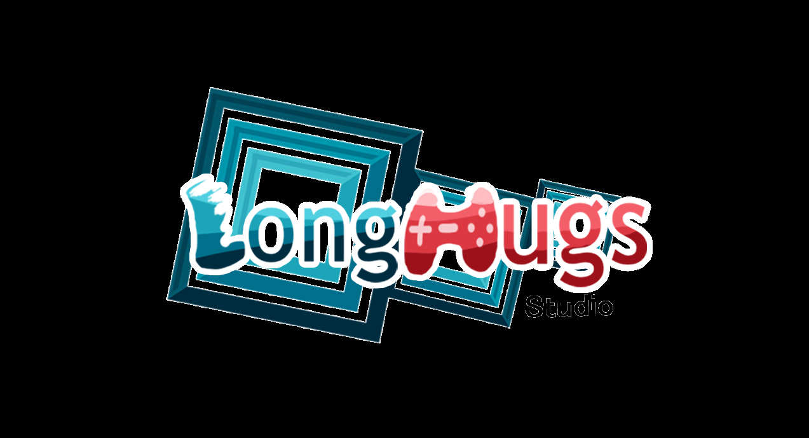
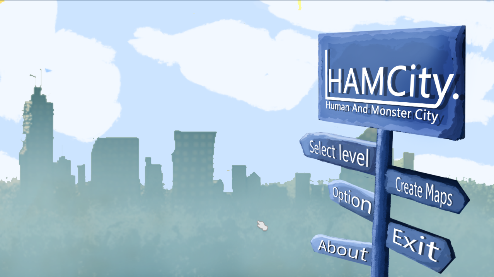
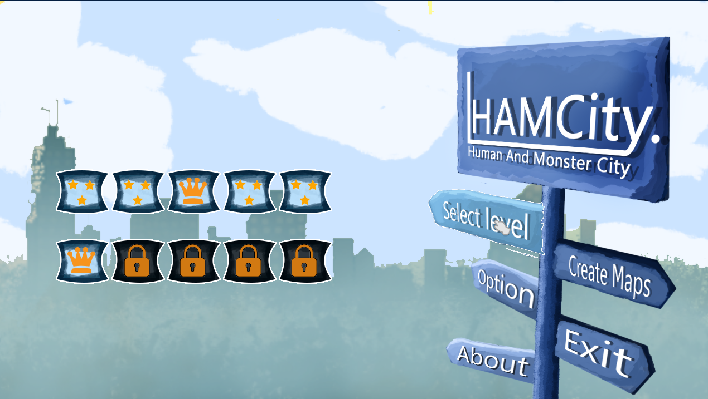
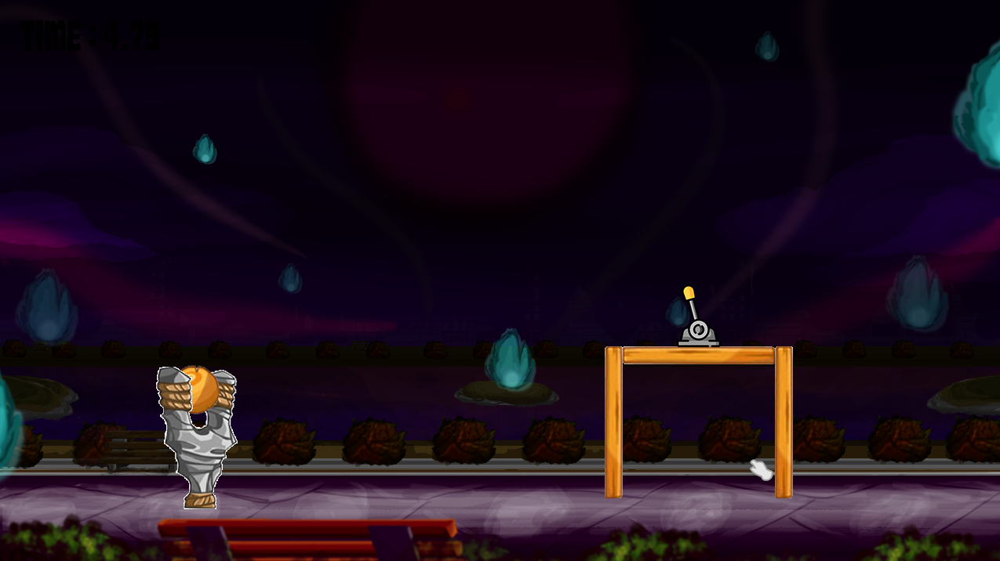
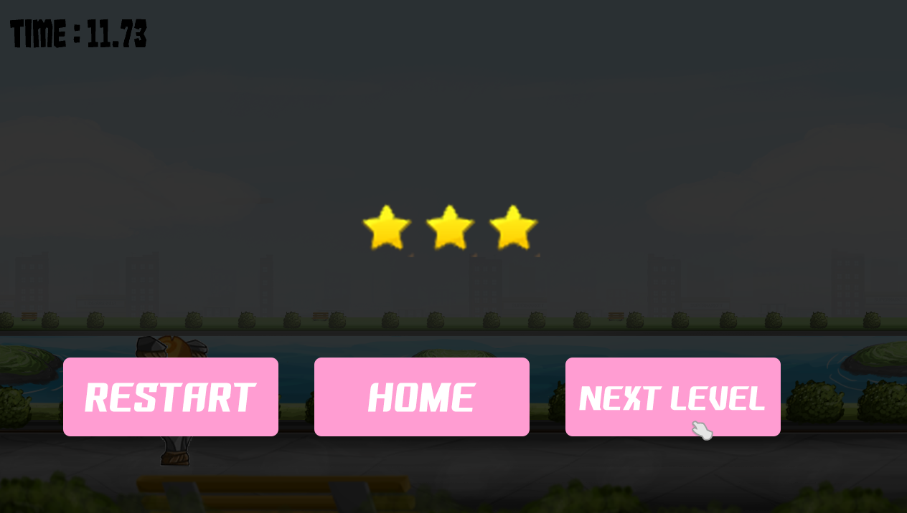

# Ham City

Catapult game with basic logic by monogame.

## Installation

***Windows***:

> Check installer windows version (Win10 DX support) in __releases__ page. (Coming soon . . .)

## Screen Shot

## Release History
* 0.0.1 (Present version)
    * more bug but can play with basic game level.

## Contributing

1. Fork it (<https://github.com/PePoDev/HamCity/fork>)
2. Create your feature branch (`git checkout -b feature/fooBar`)
3. Commit your changes (`git commit -am 'Add some fooBar'`)
4. Push to the branch (`git push origin feature/fooBar`)
5. Create a new Pull Request
